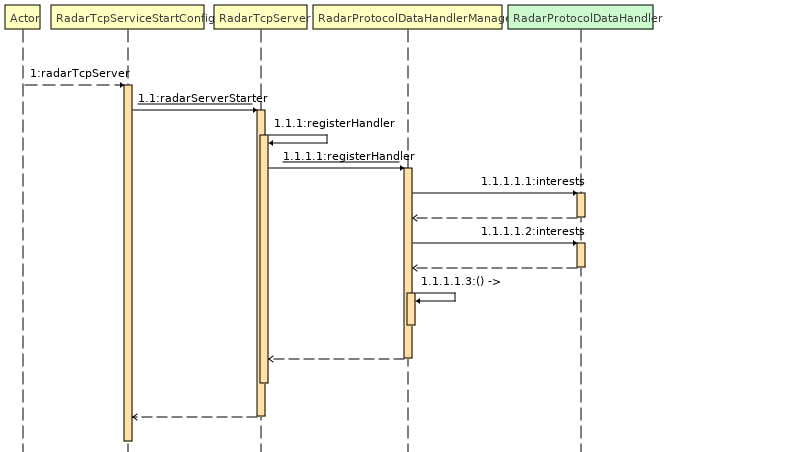
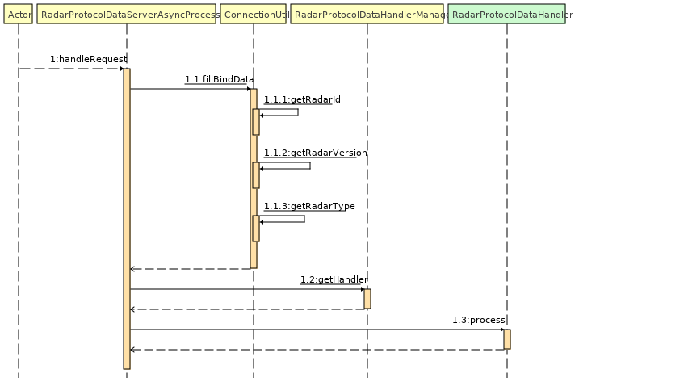

## 一，架构解析 

### 1，服务启动流程图
## 使用springboot加载配置文件，然后初始化tcp服务，tcp服务初始化时设置雷达协议处理器。


### 2，雷达服务器请求处理时序图
## 底层通过RadarCommandDecoder协议解码拆包，然后通过RadarSerializer反序列化，最终按如下时序图流程调用各个handler处理


```java
package com.radar.fall.tcp.service.fromRadar;

import com.google.common.collect.Sets;
import RadarProtocolDataHandler;
import FunctionEnum;
import RadarProtocolData;
import ByteUtil;
import org.springframework.stereotype.Service;

import java.util.Set;

/**
 * @author ：ywb
 * @date ：Created in 2022/2/12 10:07
 * @modified By：
 * 建立连接
 */
@Service
public class CreateConnectionHandler implements RadarProtocolDataHandler {


    @Override
    public Object process(RadarProtocolData protocolData) {
        //大端返回
        RadarProtocolData radarProtocolData = new RadarProtocolData();
        radarProtocolData.setFunction(FunctionEnum.createConnection);
        radarProtocolData.setData(ByteUtil.intToByteBig(1));
        return radarProtocolData;
    }

    @Override
    public Set<FunctionEnum> interests() {
        return Sets.newHashSet(FunctionEnum.createConnection);
    }
}

```

## 二，快速开始

### 1：clone此工程
### 2：实现FunctionEnum中定义的雷达发送的命令函数handler，打上@Service注解注入到spring容器，处理相应的业务逻辑。
（此示例工程已经给出了几个handler实现，在com.radar.fall.tcp.service.fromRadar包下，相关报警逻辑需要自己实现)
### 3: 查看[README.md](../../README.md)文档，运行应用程序

## 三、服务端主动发送数据给雷达
### 通过RequestRadarUtil工具类，直接调用工具类的封装好的静态方法，调用雷达返回数据

## 四，自定义协议处理器

### 1，不行，因为每个协议都只能有一个处理器，所以不能出现多个 

