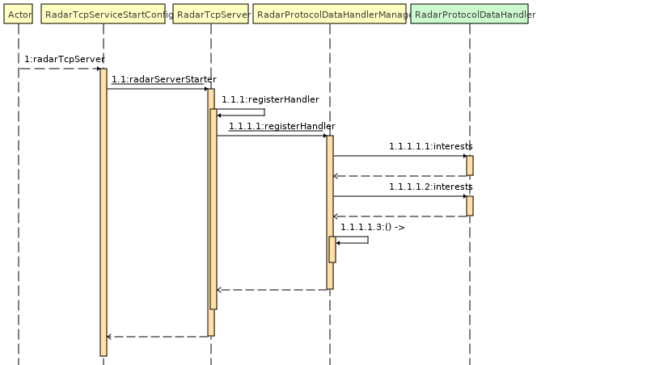
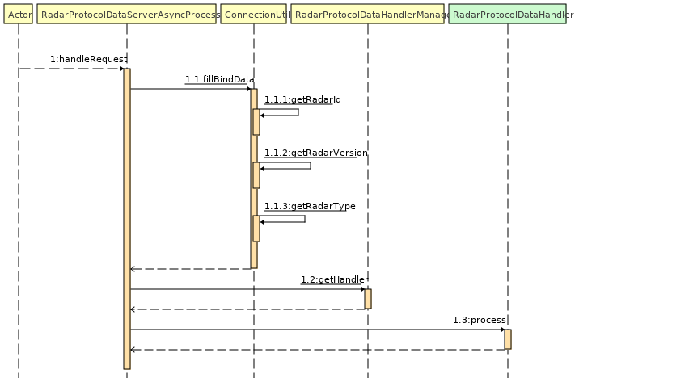

## 1. Architecture analysis

### (1) Flowchart to initiate the service


## Use springboot to load the configuration file, then initialize the tcp server. Set the radar protocol processor when the tcp server is in initializing. 
### (2) Flowchart to process the radar server request
## The bottom layer is firstly decoded and unpacked using the RadarCommandDecoder protocol, then deserialized through the RadarSerializer, and finally processed by each handler as shown in the diagram below.


```java
package com.aerosense.radar.tcp.service.fromRadar;

import com.google.common.collect.Sets;
import RadarProtocolDataHandler;
import FunctionEnum;
import RadarProtocolData;
import ByteUtil;
import org.springframework.stereotype.Service;

import java.util.Set;

/**
 * @author ：ywb
 * @date ：Created in 2022/2/12 10:07
 * @modified By：
 * establish connection
 */
@Service
public class CreateConnectionHandler implements RadarProtocolDataHandler {


    @Override
    public Object process(RadarProtocolData protocolData) {
        //big endian return
        RadarProtocolData radarProtocolData = new RadarProtocolData();
        radarProtocolData.setFunction(FunctionEnum.createConnection);
        radarProtocolData.setData(ByteUtil.intToByteBig(1));
        return radarProtocolData;
    }

    @Override
    public Set<FunctionEnum> interests() {
        return Sets.newHashSet(FunctionEnum.createConnection);
    }
}

```

## 2. Quick start

### (1) Clone this project
### (2) Implement the command handler as defined in FunctionEnum and sent by the radar, Annotate it with @Service and inject it into the spring container to process the corresponding logic. There are several examples of the implementation of the handlers, as shown in the package " com.aerosense.radar.tcp.service.fromRadar". However, the developer is recommended to user their own logic to implement the alerts.
### (3) See [README.md](../../README.md) doc and run application.


## 3. The server proactively sends data to the radar
### A static method that has been encapsulated can be directly called by using the tool " RequestRadarUtil" to call the data that has been returned by the radar.

## 4. It is NOT allowed as there can be ONLY one processor for each protocol.

